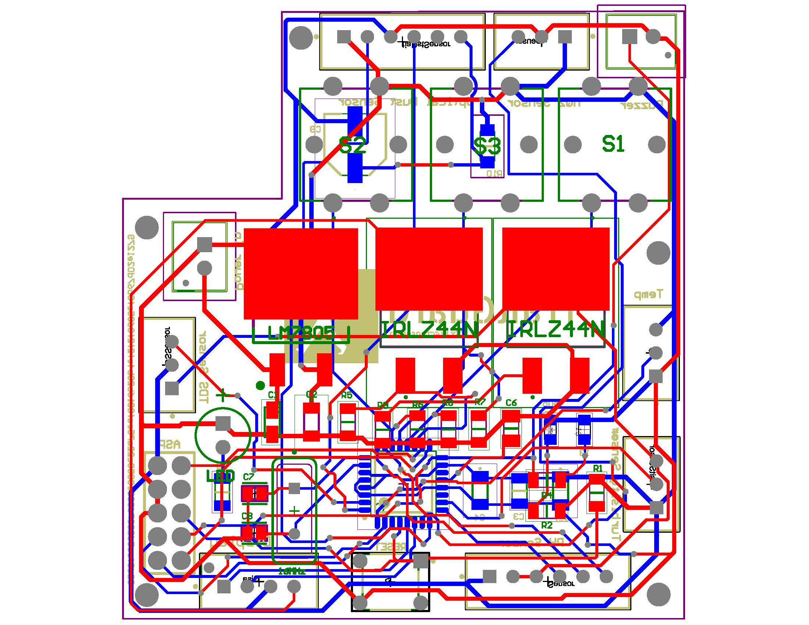
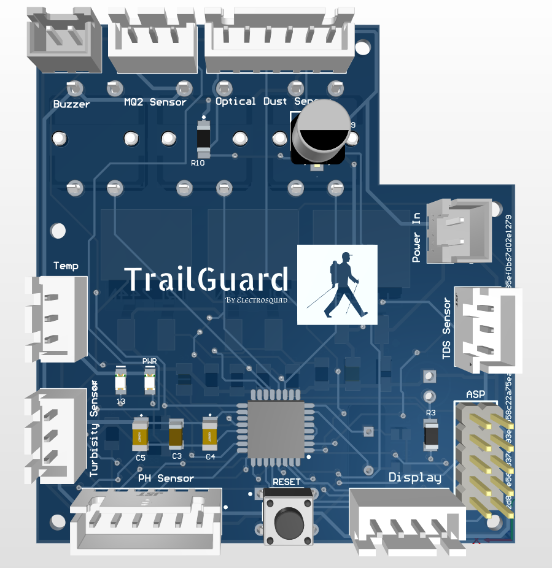
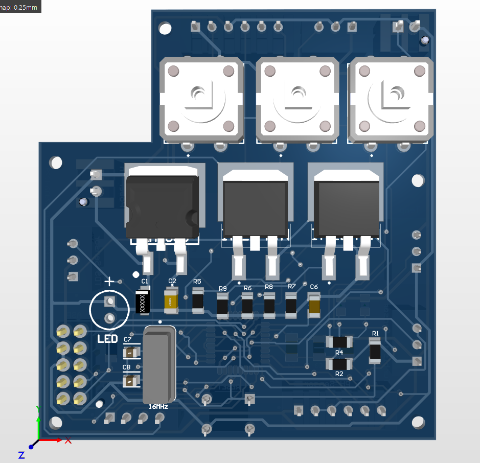
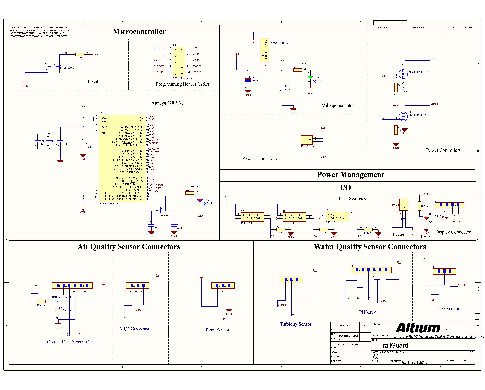
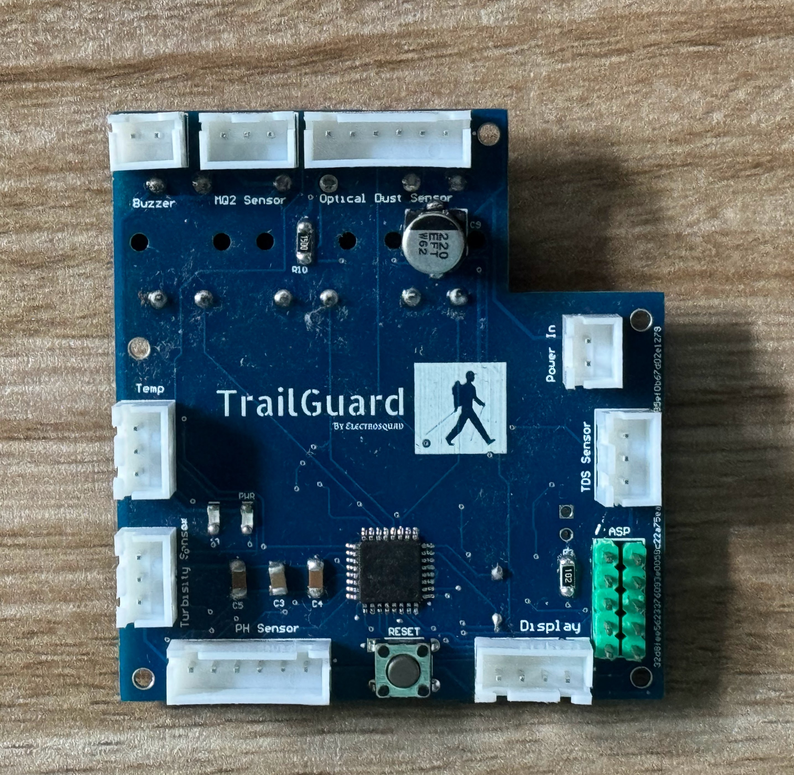
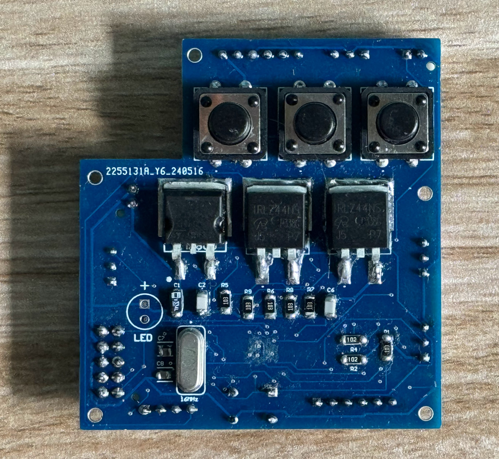

## TrailGuard
Trail Guard is a portable device that monitors various environmental parameters, including air and water quality, using a wide range of sensors. This comprehensive monitoring tool is designed to be valuable for both travelers and residents who are concerned about their environmental conditions.. 

## Table of Contents

## Why "Trail Guard"?

## Features
- **Portable**: Trail Guard is a portable device that can be easily carried around.
- **Comprehensive**: Trail Guard monitors a wide range of air and water quality parameters.
- **User-friendly**: Trail Guard is designed to be user-friendly and easy to use.
- **Real-time monitoring**: Trail Guard provides real-time monitoring of environmental parameters.
- **Alert system**: Trail Guard has an alert system that notifies users of any harmful environmental conditions.

## Hardware Specifications
- **Microcontroller**: Atmega328P-AU
- **Sensors**: 
  - Temperature and Humidity Sensor (DHT11)
  - Air Quality Sensor (MQ2)
  - Water Quality Sensor (PH Sensor)
  - TDS Sensor
  - Turbidity Sensor
  - Dust Sensor (GP2Y1010AU0F)
- **Display**: 0.96 inch OLED Display
- **User Interface**: 2 Push Buttons and LED Indicator

## Software Specifications
- **Programming Language**: C++ (Arduino)
- **IDE**: Arduino IDE
- **Libraries**:
  - Adafruit_Sensor
  - Adafruit_GFX
  - Adafruit_SSD1306
  - DHT
- **PCB Design Software**: Altium Designer
- **3D Modelling Software**: SolidWorks

## PCB design
The PCB design of Trail Guard was done using Altium Designer. The PCB design files are available in the `TrailGuard2.0` folder.

    
    

## PCB Schematic

## PCB

    
    

## SolidWorks Design

    
    

## Product View

    

## Team Members
| Name | Index Number |Email|
|------|--------------|--------------|
| Balasooriya B A P I | 220054N | balasooriyabapi.22@uom.lk |
| Dewasumithra M P O | 220112R| dewasumithrampo.22@uom.lk |
| Dineshara M C | 220128V |dinesharamc.22@uom.lk|
| Diunugala C H | 220143L | diunugalach.22@uom.lk |	

